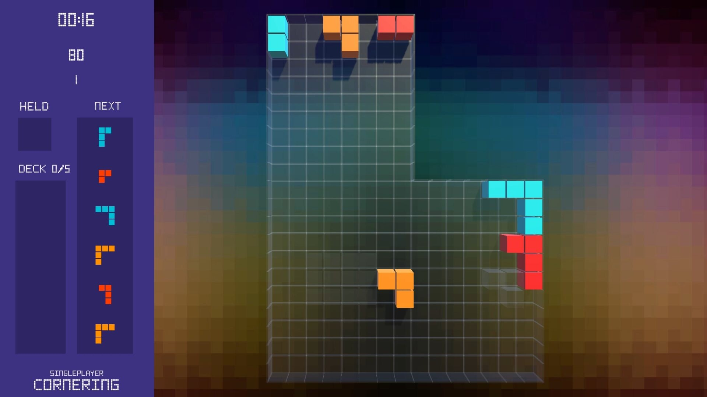

# Glue Blocks

Glue Blocks is a free falling-block game where the shapes you build become future pieces. Glue blocks into custom clusters, add them to your deck, and survive the consequences in shifting wells and gravity modes.

This build is singleplayer and includes a funky chiptune-inspired track. Multiplayer is not available in this build, but may be added later if there is time or enough demand.

[Download the latest Windows installer](https://github.com/pwlot/glueblocks/releases/latest) 
[Glue Blocks site](https://www.glueblocks.com/) 
[My site](https://www.pwlot.com/)

## How to Play

Move and rotate falling blocks into the well, then clear filled lines or pockets depending on the mode. Gravity is not always down: some modes pull pieces up, left, right, or across multi-direction wells. In multi-direction modes, your first few moves are free, then the piece locks into the direction you chose.

Glue landed blocks that touch each other with the Glue button. Keyboard default is `F`; gamepad default is `Y` / Triangle. Most modes let you glue at any time, and it is usually better to start early so your deck fills with usable custom pieces instead of waiting for a perfect shape.

Each mode has a deck limit and a maximum glued-block size. Some modes make you build your glued deck before you can clear lines, so watch the mode rules. Monster Mode allows huge glued blocks, but big pieces can be as dangerous as they are powerful.

Some modes allow reglue: a glued piece can land and then be glued into an even larger shape. Other modes disable it, so check the icons, mode info, and controls screen before a run.

## Controls

Keyboard: move with `WASD` / arrows, hard drop with `Space`, rotate with `E` / `K` and `Q` / `J`, glue with `F`, hold with `C`, release hold with `V`, rotate well with `R` / `T`, pause with `Esc`.

Gamepad: move with D-pad / left stick, hard drop with `RB/R1` or `A/Cross`, rotate with face buttons or shoulders, glue with `Y/Triangle`, hold/release hold with triggers, rotate well with right stick, pause with Start/Menu.

## Gameplay

## Screenshots

## Download

Windows builds are distributed through GitHub Releases. The Unity project source is not published here.

Latest release: [Glue Blocks releases](https://github.com/pwlot/glueblocks/releases/latest)

## Publisher

Published by [Pawel Pachniewski / Pwlot](https://www.pwlot.com/).
