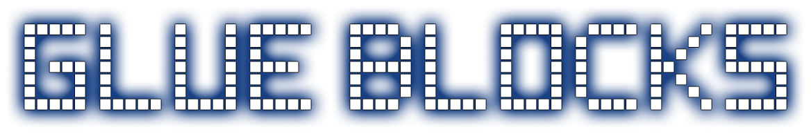
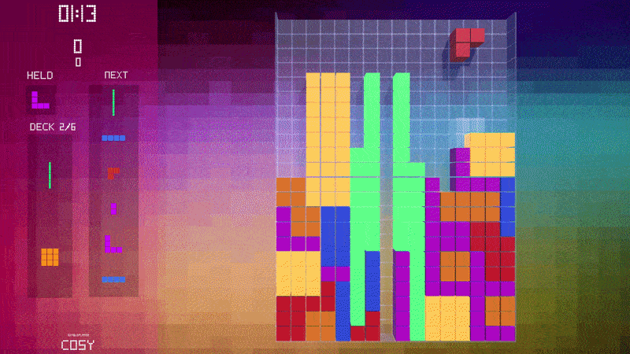
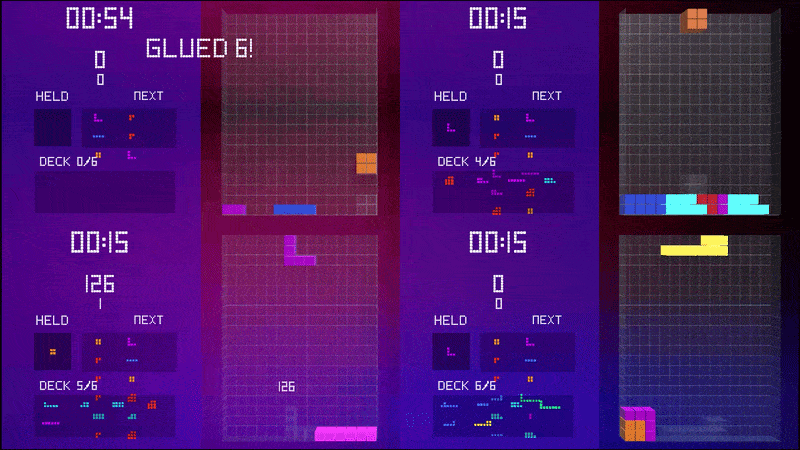
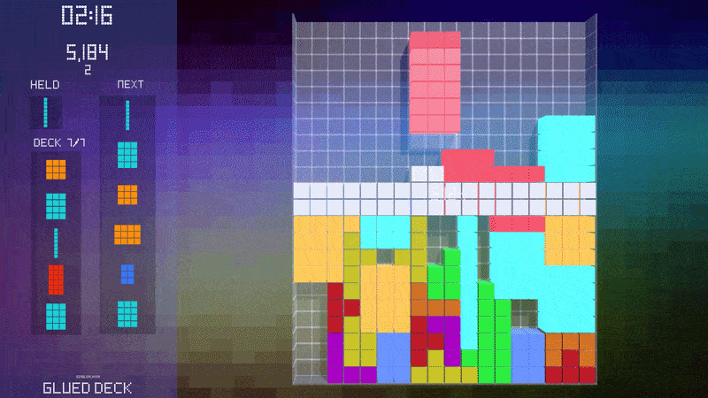
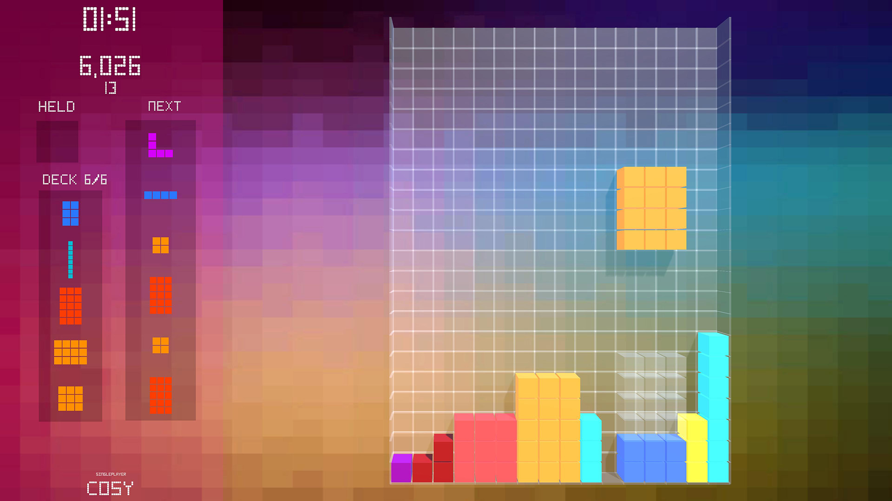
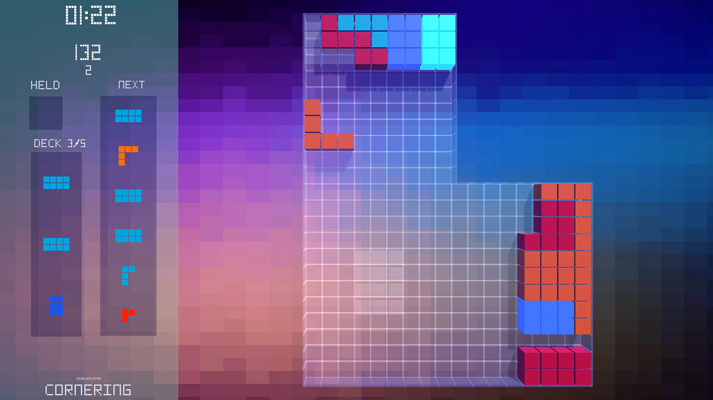
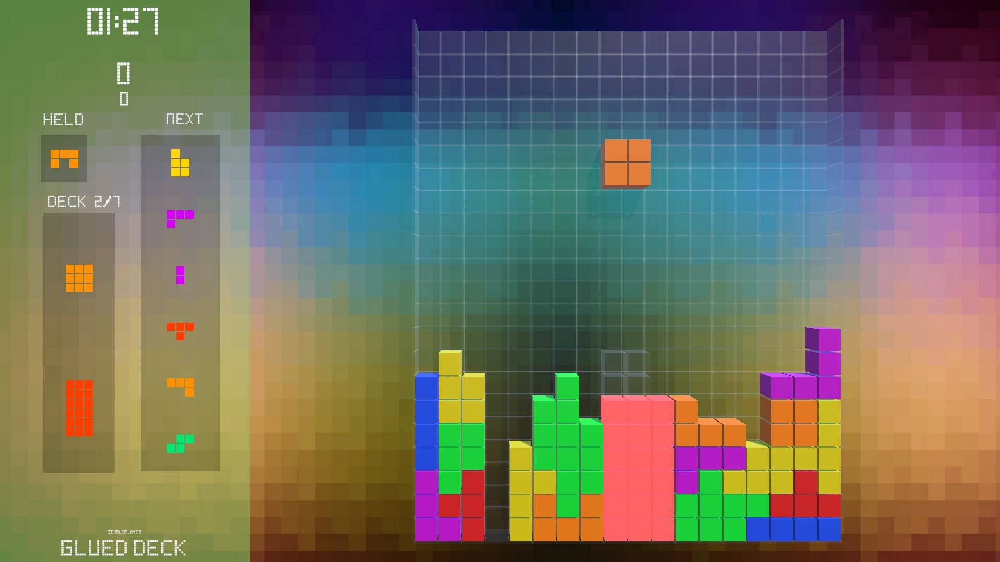

# Glue Blocks

Glue Blocks is a falling-block puzzle game where you can glue placed blocks together. Glued clusters enter your drop cycle as new pieces, so a useful shape can save a run later, while an awkward oversized shape can become the thing that buries you.

[Download the latest Windows installer](https://github.com/pwlot/glue-blocks-releases/releases/latest)  
[Glue Blocks site](https://www.glueblocks.com/)

## How It Works

1. Place falling pieces into the well.
2. Clear complete lines to keep space open.
3. Glue connected blocks into larger custom pieces.
4. Glued pieces are added to the drop cycle.
5. Bigger glued pieces can create bigger score multipliers, but they are harder to place safely.
6. Modes change the well shape, piece rules, gravity, and glue constraints.

## Gameplay

Multiplayer is not available in this build. It may be added in a future build if I have time to do it, or if there is a lot of demand.

## Screenshots

## Download

Windows builds are distributed through GitHub Releases. The Unity project source is not published here.

Latest release: [Glue Blocks releases](https://github.com/pwlot/glue-blocks-releases/releases/latest)

## Publisher

Published by [Pawel Pachniewski / Pwlot](https://www.pwlot.com/).
